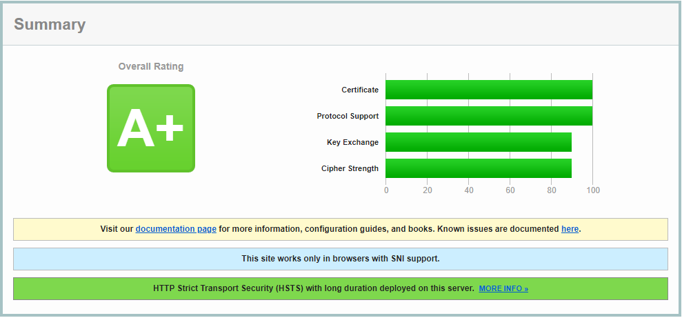
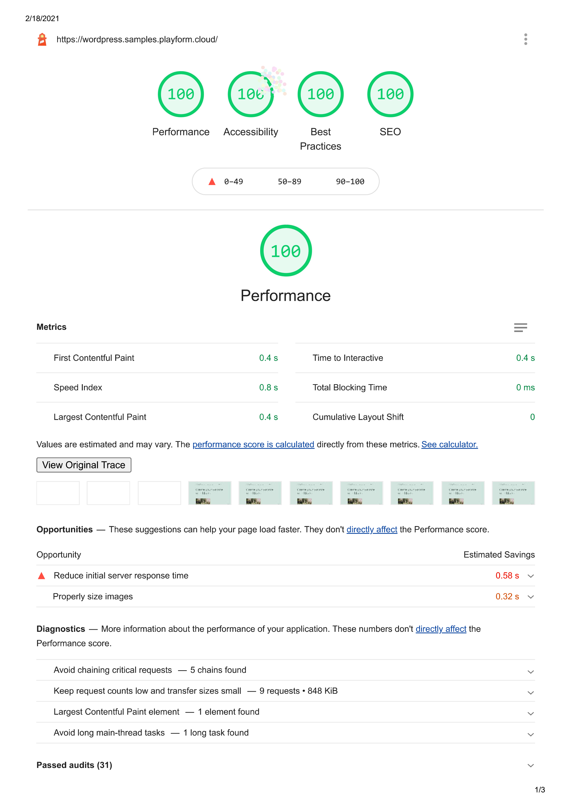
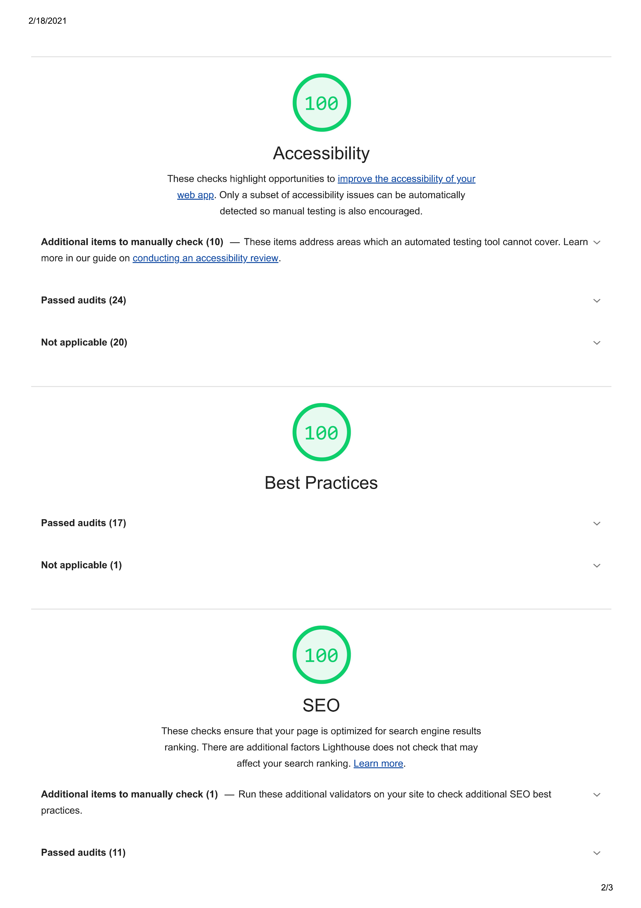

# WordPress NGINX Sample

This is a sample WordPress website with an included configuration for both PHP
and NGINX.

### Server Requirements

-   Ubuntu 22.04 LTS
-   nginx/1.23.0
    -   headers-more-nginx-module
    -   ngx_brotli
    -   ngx_devel_kit
    -   set-misc-nginx-module
-   PHP 8.1
    -   php-fpm
-   mysql Ver 8.0.29 Distrib 5.7.33
-   certbot 1.21.0

# How to use

## NGINX

Install NGINX and add the following modules to your installation:

-   HTTPS://GitHub.Com/openresty/headers-more-nginx-module
-   HTTPS://GitHub.Com/google/ngx_brotli
-   HTTPS://GitHub.Com/vision5/ngx_devel_kit
-   HTTPS://GitHub.Com/openresty/set-misc-nginx-module

Replace every occurrence of **wordpress.sample** in
[nginx/sites/wordpress.conf](nginx/sites/wordpress.conf) with **yourdomain.com**

Generating DH parameters:

```bash
mkdir -p /etc/nginx/ssl/
cd /etc/nginx/ssl/
sudo openssl dhparam -out /etc/nginx/ssl/dhparam.pem 4096
```

Issuing certificates:

```bash
sudo apt install certbot -y
certbot certonly -d yourdomain.com --standalone
certbot certonly -d www.yourdomain.com --standalone
```

## PHP

Install PHP 7.4 and [Composer](https://getcomposer.org/).

Create the session folder for PHP-FPM:

```bash
mkdir -p /usr/share/nginx/sites/wordpress/tmp/session
```

Create a new user for the WordPress installation:

```bash
adduser --no-create-home --disabled-login --disabled-password wordpress
```

## WordPress

Install [Bedrock](https://roots.io/bedrock/) in the
**/usr/share/nginx/sites/wordpress/** directory and add the required WordPress
plugins:

```sh
composer require roots/soil
composer require wpackagist-plugin/wordpress-seo
composer require wpackagist-plugin/wp-optimize
composer require wpackagist-plugin/wp-super-cache
```

Configure the WP Super Cache plugin by adding:

```php
/**
 * WP Super Cache
 */
Config::define("WP_CACHE", env("WP_CACHE") ?: false);
Config::define("WPCACHEHOME", $root_dir . "/web/app/plugins/wp-super-cache/");
```

to your **config/application.php** file and WP_CACHE your to **.env** file:

```bash
WP_CACHE=true
```

### WP CLI

Setup [WP CLI](https://wp-cli.org/) and install WordPress:

```bash
alias wp='wp --allow-root'

wp core install \
	--title="Sample" \
	--admin_user="Administrator" \
	--admin_password="Administrator" \
	--admin_email="Administrator@Playform.Cloud" \
	--url="https://WordPress.Sample" \
	--skip-email

# Update permalink structure.
wp option update permalink_structure "/%postname%/" --skip-themes --skip-plugins
wp rewrite structure "/%postname%/"

wp plugin activate soil
wp plugin activate wordpress-seo
wp plugin activate wp-optimize
wp plugin activate wp-super-cache
```

# Result

 

